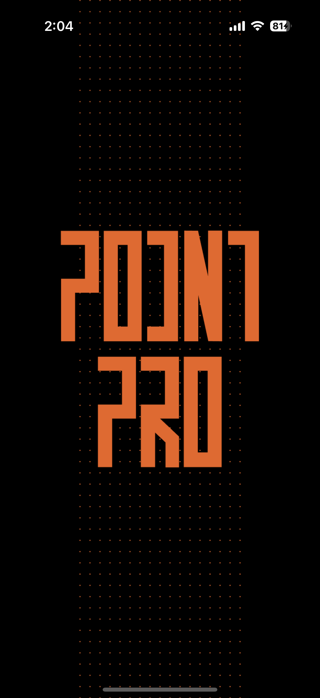
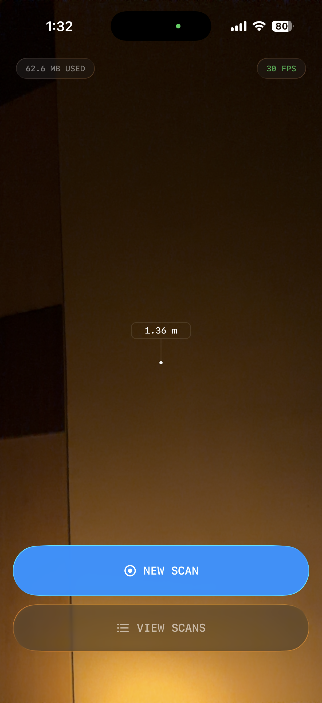
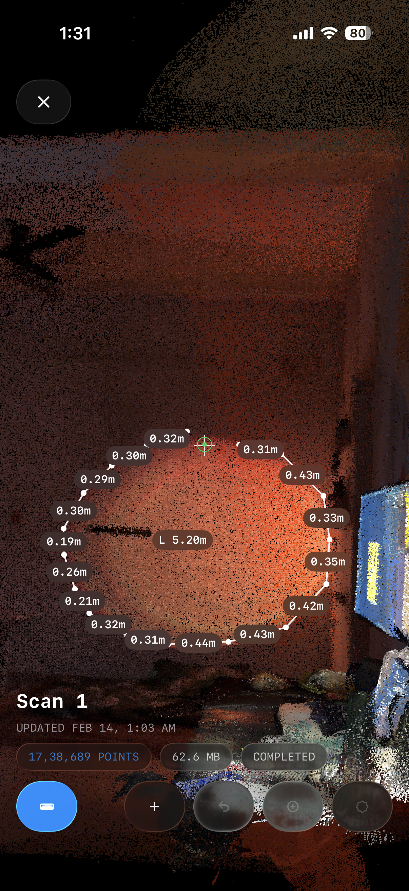
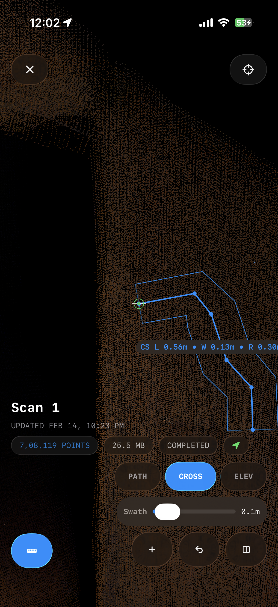
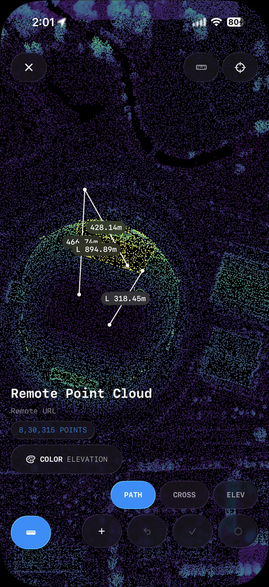
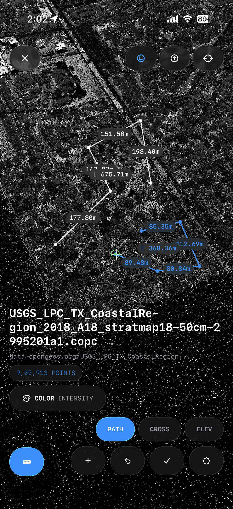

# PointPro

PointPro is an iOS LiDAR app for on-device point cloud capture, remote COPC loading, measurement, and deliverable export.

## Current Capabilities

- Real-time LiDAR capture pipeline with scan session management
- Remote point cloud import via HTTPS URL (`.copc.laz` / `.laz`) with progressive refinement
- Interactive 3D viewer (pan, orbit, zoom, recenter, roll lock/unlock)
- Color modes: `Auto`, `RGB`, `Elevation (Viridis)`, `Intensity`, `Classification`
- Measurement workflows:
  - Vertex snapping with path and closed-area tools
  - Distance, perimeter, and area
  - Cross-section and elevation profile analysis
- Export workflows:
  - `LAZ` (device-GPS georeferenced) + metadata sidecar (`.json`)
  - `PLY (Binary, Fast)` and `PLY (Text, ASCII)`
  - Enterprise-style PDF report (stats, georef context, measurement register, visual evidence)
- Import/export UX with progress, cancellation, and native share

<table>
<tr>
  <td></td>
  <td></td>
  <td></td>
</tr>
<tr>
  <td></td>
  <td></td>
  <td></td>
</tr>
<tr>
  <td></td>
  <td></td>
  <td></td>
</tr>
</table>

## Tech Stack

- SwiftUI, ARKit, Metal / MetalKit
- Local on-device session storage

## Project Structure

```text
PointPro/           # iOS app, Xcode project, tests
docs/               # Product and export/report documentation
assets/             # Screenshots and brand assets
```

## Requirements

- macOS with Xcode
- LiDAR-capable iPhone for full capture workflow

## Run Locally

1. Open `PointPro/PointPro.xcodeproj` in Xcode.
2. Select the `PointPro` scheme.
3. Run on a physical device.

## Status

Active development. Core capture, COPC import, measurement, and export/report pipelines are functional.

## License

No license file is currently defined in this repository.
