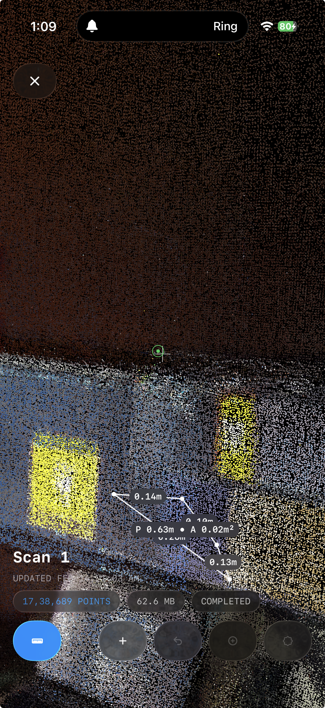

# PointPro

iOS LiDAR app for on-device capture, point-cloud viewing, measurement, and PLY export.



## Current Capabilities

- Real-time point cloud capture and session management
- 3D viewer: pan, orbit, zoom, roll
- Crosshair measurement: vertex snapping, polylines/polygons, edge distances, length/perimeter/area
- PLY export: binary and ASCII; progress, cancel, share

## Tech Stack

- SwiftUI, ARKit, Metal / MetalKit
- Local session storage

## Project Structure

```text
PointPro/           # App + Xcode project, tests
docs/               # PRD.md, CHANGELOG_AND_SPECS.md
assets/             # Screenshot and app icon assets
```

## Requirements

- Xcode on macOS
- LiDAR-capable iPhone for full functionality

## Run Locally

1. Open `PointPro/PointPro.xcodeproj` in Xcode.
2. Select the `PointPro` scheme and run on device.

## Status

In development. Capture, viewing, measurement, and export are functional.

## License

No license file is currently defined in this repository.
