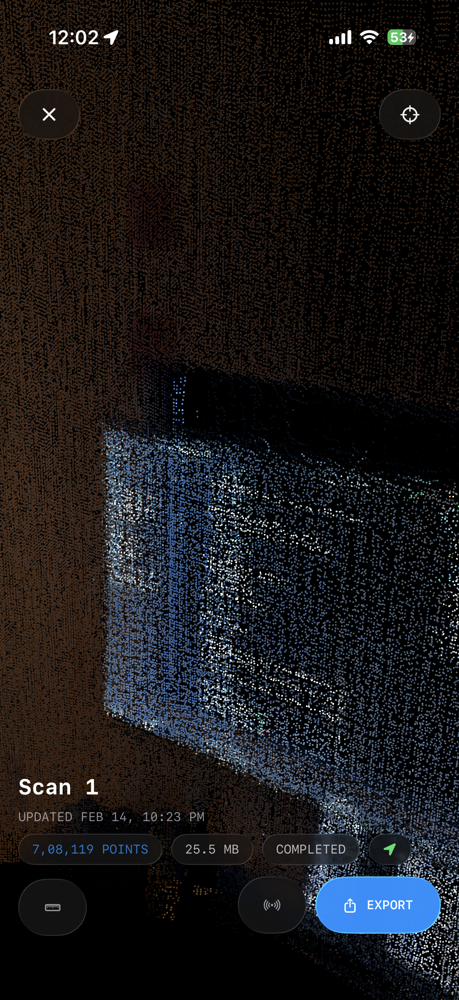
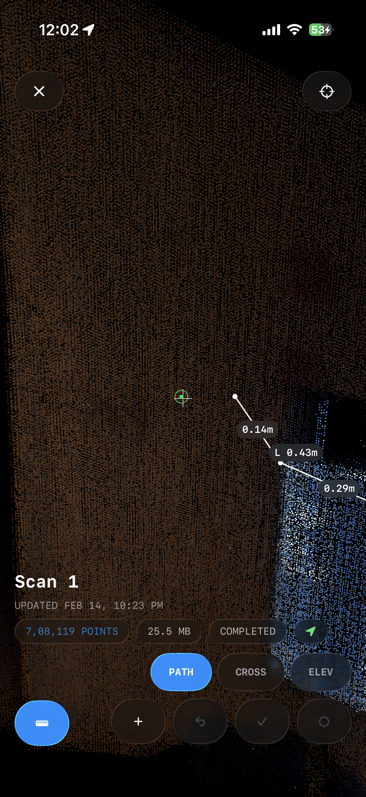
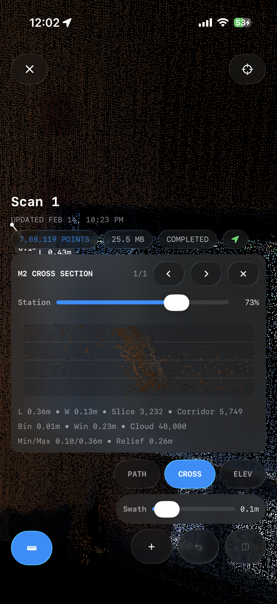
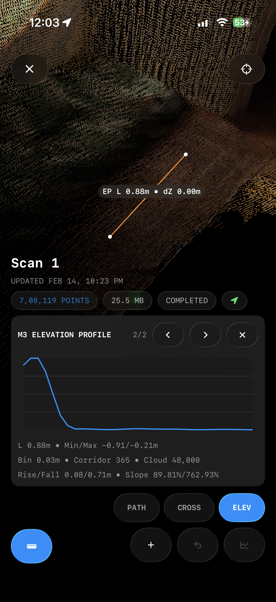
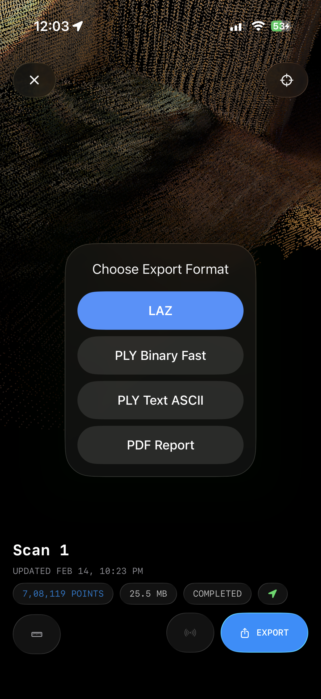

# PointPro

PointPro is an iOS LiDAR app for on-device point cloud capture, review, measurement, and deliverable export.

## Current Capabilities

- Real-time point cloud capture with session management
- Interactive 3D viewer (pan, orbit, zoom, roll, recenter)
- Measurement workflows:
  - Vertex snapping with polyline/polygon tools
  - Distance, perimeter, and area
  - Cross-section and elevation profile analysis
- Export workflows:
  - LAZ (georeferenced using device GPS, with metadata sidecar)
  - PLY (Binary, Fast) and PLY (Text, ASCII)
  - PDF survey report with visual evidence and measurement analytics
- Export UX with progress, cancellation, and native share

<table>
<tr>
  <td></td>
  <td></td>
  <td></td>
</tr>
<tr>
  <td></td>
  <td></td>
  <td></td>
</tr>
<tr>
  <td></td>
  <td></td>
  <td></td>
</tr>
</table>

## Tech Stack

- SwiftUI, ARKit, Metal / MetalKit
- Local on-device session storage

## Project Structure

```text
PointPro/           # iOS app, Xcode project, tests
docs/               # Product and export/report documentation
assets/             # Screenshots and brand assets
```

## Requirements

- macOS with Xcode
- LiDAR-capable iPhone for full capture workflow

## Run Locally

1. Open `PointPro/PointPro.xcodeproj` in Xcode.
2. Select the `PointPro` scheme.
3. Run on a physical device.

## Status

Active development. Core capture, measurement, and export pipelines are functional.

## License

No license file is currently defined in this repository.
